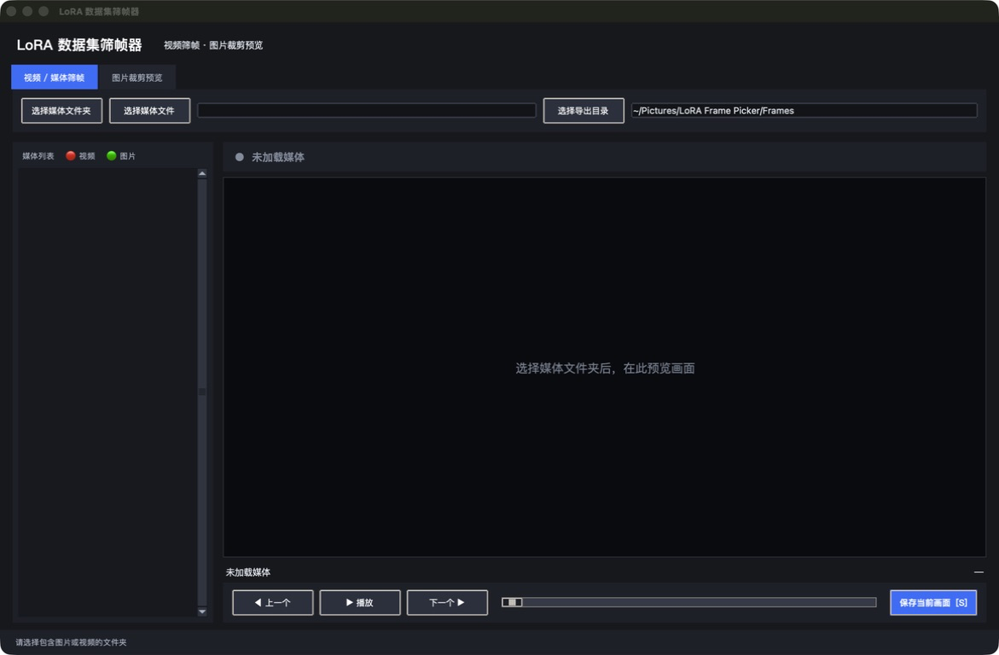

# LoRA Frame Picker

Pick clear frames from videos, preview and crop images in batches, and prepare LoRA training datasets locally. Supports Windows 10/11, Apple Silicon Macs, and Intel Macs.

[中文说明](README.md)



> Media is processed locally. The desktop application requires no account, API key, or cloud service. The optional phone WebUI is intended only for a trusted local network.

## Download

| Your computer | Installer |
|---|---|
| Windows 10/11 x64 | [Download Windows Setup](https://github.com/PA5MIN/lora-frame-picker/releases/latest/download/LoRA-Frame-Picker-Windows-x64-Setup.exe) |
| Apple Silicon Mac (M1/M2/M3/M4/M5) | [Download Apple Silicon DMG](https://github.com/PA5MIN/lora-frame-picker/releases/latest/download/LoRA-Frame-Picker-macOS-Apple-Silicon.dmg) |
| Intel Mac | [Download Intel Mac DMG](https://github.com/PA5MIN/lora-frame-picker/releases/latest/download/LoRA-Frame-Picker-macOS-Intel.dmg) |

Python and all runtime dependencies are included. Download the matching installer, open it, and start using the app—no development environment is required.

## What you can do

- Video playback, timeline seeking, frame-by-frame navigation, and JPEG export
- Image preview, common aspect-ratio crops, original-image export, and automatic black-border removal
- Phone upload, preview, and frame export over the same trusted Wi-Fi network
- Protection against selecting the same source and output directory
- Unicode filename handling and sensible Windows font fallbacks
- User-writable default folders under `Pictures/LoRA Frame Picker`
- Desktop installers with Python and all runtime dependencies bundled

## Installation

### Windows

1. Double-click the downloaded `Setup.exe`.
2. Choose **Install**. The default per-user installation does not require administrator access.
3. Launch the app immediately or use the Start Menu shortcuts for **LoRA Frame Picker** and **LoRA Phone WebUI**.

### macOS

1. Open the downloaded `.dmg`.
2. Drag `LoRA-Frame-Picker.app` and, if needed, `LoRA-Phone-WebUI.app` to the Applications shortcut.
3. Launch them later from Applications.

Your operating system may show a security prompt the first time you open the app:

- **Windows:** confirm that the installer came from this project's GitHub Releases page, then choose **More info** → **Run anyway** if Windows displays an unknown-publisher warning. The setup wizard is in English; choose **Next** and then **Install**.
- **macOS:** if a normal double-click is blocked, Control-click the app in Finder, choose **Open**, and confirm once more.

These are first-launch operating-system prompts and do not change the app's local-only media processing.

## Optional: run from source

If a matching installer is not available, download the repository ZIP and extract it. The first source launch needs an internet connection to install dependencies; later launches can work offline.

### Windows source launcher

1. Install [Python 3.9 or newer](https://www.python.org/downloads/windows/) and enable **Add python.exe to PATH**.
2. Double-click `Start-LoRA-Frame-Picker.bat`.
3. For the phone interface, double-click `Start-LoRA-WebUI.bat`.

### macOS source launcher

1. Install [Python 3.9 or newer](https://www.python.org/downloads/macos/).
2. Double-click `Start-LoRA-Frame-Picker.command`.
3. For the phone interface, double-click `Start-LoRA-WebUI.command`.

The launchers create a project-local `.venv` and install only missing packages. They do not modify system Python packages. If macOS does not allow the command files to run, open Terminal in the project folder and run:

```bash
chmod +x *.command
```

## Phone WebUI

Launch **LoRA Phone WebUI** from Applications or the Windows Start Menu. A browser page opens automatically and displays the complete phone URL with a temporary access key. The computer and phone must be connected to the same trusted Wi-Fi network.

- A new random access key is generated on every run.
- Uploads default to `Pictures/LoRA Frame Picker/Uploads`.
- Exports default to `Pictures/LoRA Frame Picker/Exports`.
- Source users can run `Configure-LoRA-WebUI.command` or `Configure-LoRA-WebUI.bat` to change folders.
- The upload limit is 12 GiB per file.
- Stop the installed WebUI using the button at the top of its page. Source users can also press `Ctrl+C`.
- Never expose the WebUI directly to the public internet.

Some phone browsers cannot play MKV, AVI, or unusual codecs directly. MP4/H.264 and MOV are the most compatible choices; use the desktop picker for other formats.

## Keyboard shortcuts

| Key | Video/media tab | Image crop tab |
|---|---|---|
| `Space` | Play/pause | Save and move to the next image |
| `←` / `→` | Previous/next frame | Previous/next image |
| `↑` / `↓` | Previous/next media file | — |
| `S` | Save the current frame | Save the current image |
| `1`–`8` | — | Select a crop preset |
| `[` / `]` | — | Cycle crop presets |

Always keep the media source and export directories separate. The application blocks identical directories and skips an export directory nested inside the source while scanning.

## Troubleshooting

### Python was not found

This applies only to source launchers. Install Python 3.9 or newer from python.org. On Windows, enable the PATH option during installation, then run the launcher again.

### Dependency installation failed

Check the internet connection, proxy settings, and available disk space. Delete the project-local `.venv` and run the launcher again to rebuild it. The virtual environment does not contain personal media.

### A video cannot be opened or shows no image

OpenCV supports common formats but not every container and codec. Try MP4/H.264 or MOV first, or transcode the file with a trusted tool.

### The phone cannot open the WebUI

Confirm that both devices use the same Wi-Fi, guest-network isolation is disabled, and the app is allowed through the computer firewall. Open the complete URL displayed by the computer, including the value after `key=`.

Still having trouble or found a bug? Please open an [Issue](https://github.com/PA5MIN/lora-frame-picker/issues) with your operating system version, app version, and error message. Do not upload private media or secrets.

## For developers and contributors

```bash
python3 -m venv .venv
.venv/bin/python -m pip install -r requirements-dev.txt
.venv/bin/python -m pytest
.venv/bin/python packaging/audit_release.py
```

Pushing a `v*` tag starts GitHub Actions builds for Windows x64, Apple Silicon macOS, and Intel macOS. PyInstaller does not cross-compile these packages, so each artifact is built on its matching GitHub-hosted runner.

### Privacy boundary for contributions

This repository should contain only source code, static web assets, tests, documentation, and build configuration. Never commit:

- Personal photos, videos, datasets, exports, or model weights
- LoRA, checkpoint, ONNX, or other generated model files
- HAR traces, sessions, real configuration, tokens, licenses, credentials, or `.env`
- Local directory settings, caches, virtual environments, or build artifacts

Run `python packaging/audit_release.py` before publishing. See [SECURITY.md](SECURITY.md) and [CONTRIBUTING.md](CONTRIBUTING.md).

## License

[MIT License](LICENSE)
